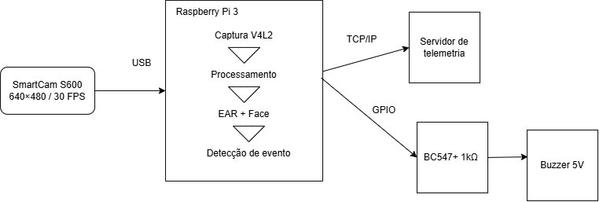
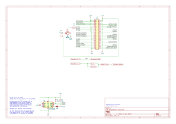

# 4.1 Projeto Conceitual de Hardware

O projeto conceitual de hardware do Sistema de Detecção de Sonolência e Distração do Motorista (DMS) define os componentes responsáveis pela captura de imagens, processamento local, detecção de eventos, acionamento do alerta e comunicação com o servidor remoto.

A arquitetura foi desenvolvida considerando o processamento local no dispositivo embarcado, de forma que a detecção de sonolência e distração e o acionamento do alarme não dependam da disponibilidade da rede ou do servidor remoto.

## 4.1.1 Processamento

O processamento principal do sistema é realizado por uma Raspberry Pi 3 Model B, disponibilizada pelo professor.

A Raspberry Pi 3 Model B possui processador Broadcom BCM2837 com quatro núcleos ARM Cortex-A53 e 1 GB de memória RAM. O processamento da aplicação é realizado localmente, utilizando linguagem C/C++.

A Raspberry Pi é responsável por:

* receber os quadros de vídeo provenientes da câmera;
* realizar a captura utilizando V4L2;
* executar o processamento das imagens;
* identificar características faciais;
* calcular o Eye Aspect Ratio (EAR);
* detectar eventos de micro-sono;
* detectar distração por meio da orientação da cabeça;
* registrar eventos localmente;
* acionar o buzzer por meio de GPIO;
* transmitir informações de telemetria ao servidor remoto.

O processamento da detecção ocorre localmente para evitar que a comunicação de rede seja um requisito para o funcionamento do alarme.

## 4.1.2 Sensor

O único sensor utilizado no sistema é a SmartCam S600, responsável pela aquisição das imagens do motorista.

A câmera é conectada à Raspberry Pi 3 Model B por meio da interface USB e utiliza o padrão UVC (USB Video Class). A aquisição das imagens é realizada por meio do V4L2 (Video4Linux2).

As principais características utilizadas no projeto são:

* resolução: 640 × 480 pixels;
* taxa de aquisição: 30 FPS;
* interface: USB;
* protocolo de captura: UVC/V4L2.

A câmera é utilizada para fornecer os quadros necessários à identificação facial, cálculo do EAR e análise da orientação da cabeça.

O sistema não utiliza câmera infravermelha. O desempenho em condições de baixa luminosidade deverá ser validado experimentalmente durante os testes do sistema, não sendo considerado garantido apenas pela utilização da interface UVC.

## 4.1.3 Atuador

O atuador utilizado para alertar o motorista é um buzzer ativo de 5 V.

O buzzer é acionado por meio de uma saída GPIO da Raspberry Pi. Como a saída GPIO não deve alimentar diretamente o buzzer, é utilizado um transistor BC547 como estágio de acionamento.

A interface de acionamento é composta por:

* GPIO 17 da Raspberry Pi;
* resistor de 1 kΩ;
* transistor BC547;
* buzzer ativo de 5 V.

Quando um evento de micro-sono ou distração é confirmado, a aplicação envia o sinal de acionamento ao GPIO, fazendo com que o transistor conduza e alimente o buzzer.

O alarme deve ser interrompido quando a condição de alerta deixar de ser detectada, conforme definido nos requisitos funcionais do sistema.

## 4.1.4 Comunicação

O sistema possui duas interfaces principais de comunicação.

### Comunicação com a câmera

A SmartCam S600 é conectada à Raspberry Pi por USB. A captura dos quadros utiliza o padrão UVC e a interface V4L2 do sistema operacional.

### Comunicação com o servidor

A Raspberry Pi utiliza a conexão **Wi-Fi ou Ethernet** para transmitir dados de telemetria a um servidor remoto utilizando comunicação TCP/IP.

O servidor remoto possui função secundária, sendo utilizado para receber e armazenar informações dos eventos detectados.

A comunicação com o servidor não faz parte do caminho crítico do sistema de alerta. Dessa forma, uma falha na rede ou no servidor não deve interromper ou atrasar:

* a captura das imagens;
* o processamento local;
* a detecção dos eventos;
* o acionamento do buzzer.

Essa separação permite que o sistema continue funcionando localmente mesmo quando a comunicação remota estiver indisponível.

## 4.1.5 Armazenamento

O armazenamento local é realizado por meio de um cartão microSD de 16 GB, utilizado pela Raspberry Pi 3 Model B.

O cartão é utilizado para:

* sistema operacional;
* aplicação do DMS;
* arquivos de configuração;
* registros locais de eventos;
* armazenamento temporário de informações necessárias ao funcionamento da aplicação.

Os registros de eventos devem conter informações como:

* timestamp;
* identificação do veículo;
* tipo de alerta;
* valor do EAR, quando aplicável.

A capacidade do cartão é suficiente para o armazenamento do sistema operacional, aplicação e registros de eventos previstos para o projeto.

## 4.1.6 Interface com o usuário

A interface de alerta ao motorista é realizada por meio do buzzer.

O sistema não utiliza display como interface de usuário nesta versão do projeto. O objetivo principal da interface é fornecer um alerta sonoro imediato quando uma situação de micro-sono ou distração for confirmada.

O servidor remoto é utilizado para telemetria e registro de informações, não sendo considerado a interface principal de interação com o motorista.

## 4.1.7 Estrutura física

A estrutura física do sistema deve proteger os componentes eletrônicos e permitir a instalação adequada da câmera no veículo.

A estrutura prevista é composta por:

* caixa de proteção para a Raspberry Pi 3 Model B;
* suporte ajustável para posicionamento da SmartCam S600;
* proteção para o circuito de acionamento do buzzer;
* cabos e conexões necessários para a montagem.

O suporte da câmera deve permitir o ajuste do seu posicionamento de forma que o rosto do motorista permaneça adequadamente enquadrado durante a operação.

O circuito de acionamento do buzzer deve permanecer protegido contra contatos acidentais e possíveis danos mecânicos.

## 4.1.8 Diagrama de blocos

O diagrama de blocos apresenta a arquitetura geral do hardware e a relação entre os principais subsistemas do DMS.

**Figura 1 – Diagrama de blocos do sistema DMS.**

A SmartCam S600 fornece os quadros de vídeo para a Raspberry Pi 3 Model B por meio da interface USB. Na Raspberry Pi, os quadros são capturados pelo V4L2 e encaminhados para o processamento de imagens.

O processamento realiza a identificação facial, cálculo do EAR e análise da orientação da cabeça. A partir dessas informações, o sistema determina a ocorrência de eventos de micro-sono ou distração.

Após a confirmação de um evento, existem dois caminhos independentes:

1. **Alerta local:** o GPIO aciona o estágio formado pelo BC547 e pelo resistor de 1 kΩ, ativando o buzzer.
2. **Telemetria:** as informações do evento são transmitidas ao servidor remoto por TCP/IP.

O servidor remoto não participa da decisão do alerta local.

## 4.1.9 Esquemático elétrico

O circuito de acionamento do buzzer utiliza um transistor BC547 como chave eletrônica.

As conexões principais são:

- GPIO17 da Raspberry Pi (pino físico 11) → resistor R1 de 1 kΩ → base do BC547;
- emissor do BC547 → GND;
- coletor do BC547 → terminal negativo do buzzer;
- terminal positivo do buzzer → +5 V.

O acionamento do buzzer será realizado pelo GPIO17 da Raspberry Pi 3 Model B, correspondente ao pino físico 11 do conector GPIO. Essa definição deverá ser mantida de forma consistente entre o esquemático elétrico e a implementação do software.

A SmartCam S600 é conectada diretamente a uma porta USB da Raspberry Pi 3 Model B.

**Figura 2 – Esquemático elétrico do circuito de acionamento do buzzer.**

O esquemático elétrico foi desenvolvido no KiCad, utilizando símbolos elétricos, conexões e identificação dos componentes. A representação em protoboard não substitui o esquemático elétrico.

## 4.1.10 Lista de materiais e análise de energia

A Tabela 1 apresenta a lista preliminar de materiais utilizados no sistema, incluindo tensão, corrente estimada, tempo de funcionamento e energia consumida.

Para uma estimativa inicial, considera-se um período de 1 hora (3600 s) de funcionamento.

A energia de cada componente é estimada por:

$$
E = V \times I \times t
$$

onde:

* \(E\) é a energia consumida em joules (J);
* \(V\) é a tensão de alimentação em volts (V);
* \(I\) é a corrente em ampères (A);
* \(t\) é o tempo de operação em segundos (s).

> **Observação:** os valores marcados com (*) são estimativas preliminares e deverão ser confirmados por medição ou pela especificação definitiva dos componentes utilizados.

| Componente             | Tensão (V) | Corrente (A) | Tempo (s) |   Energia (J) | Quantidade | Preço unitário (R$) | Custo total (R$) | Observações                                   |
| ---------------------- | ---------: | -----------: | --------: | ------------: | ---------: | ------------------: | ---------------: | --------------------------------------------- |
| Raspberry Pi 3 Model B |        5,0 |        0,40* |      3600 |         7200* |          1 |                0,00 |             0,00 | Fornecida pelo professor                      |
| SmartCam S600          |        5,0 |        0,50* |      3600 |         9000* |          1 |               0,00* |            0,00* | Corrente estimada e já possuímos               |
| Buzzer ativo 5 V       |        5,0 |        0,03* |      3600 |          540* |          1 |              10,00* |           10,00* | Considerado ligado continuamente no pior caso |
| BC547                  |        5,0 |        0,03* |      3600 |          540* |          1 |                0,32 |             0,32 | Corrente estimada para o acionamento          |
| Resistor 1 kΩ          |        3,3 |       0,0033 |      3600 |          39,2 |          1 |                0,14 |             0,14 | Resistor de acionamento da base               |
| microSD 16 GB          |        3,3 |        0,10* |      3600 |         1188* |          1 |              00,00* |           00,00* | Fornecida pelo professor e corrente estimada                             |
| Protoboard             |          — |            — |         — |             — |          1 |               0,00* |            0,00* | Já possuímos e não possui consumo próprio relevante          |
| Cabos/jumpers          |          — |            — |         — |             — | 1 conjunto |               0,00* |            0,00* | Já possuímos e não possui consumo próprio relevante          |
| Caixa/proteção         |          — |            — |         — |             — |          1 |               0,00* |            0,00* | Fornecida pelo professor                              |
| Fonte de alimentação   |        5,0 |            — |         — |             — |          1 |                0,00 |             0,00 | Fornecida pelo professor
| **Total**              |          — |            — |         — | **18.507 J*** |          — |                   — |            10,46 | —                                             |

A estimativa de energia total para uma hora de funcionamento, considerando o pior caso de operação com o buzzer continuamente acionado, é de aproximadamente:

$$
E_{total} = 18.507\ J
$$

ou:

$$
E_{total} \approx 5,14\ Wh
$$

Esse valor representa uma estimativa preliminar de projeto, não uma medição real do consumo do sistema. O consumo efetivo deverá ser obtido durante os testes, principalmente devido à variação de consumo da Raspberry Pi, câmera, cartão microSD e demais componentes durante diferentes condições de processamento.

Para o dimensionamento da alimentação, deve ser considerada uma margem de segurança sobre a corrente estimada, de forma a evitar operação próxima ao limite da fonte.

### Referências

1. Raspberry Pi Foundation. *Raspberry Pi Documentation – Raspberry Pi computers and power requirements*.
2. FCTE – Universidade de Brasília. *Projeto Conceitual de Hardware*. Material fornecido na disciplina.
3. Raspberry Pi Foundation. *Power Supply*. Material técnico sobre alimentação das placas Raspberry Pi.
